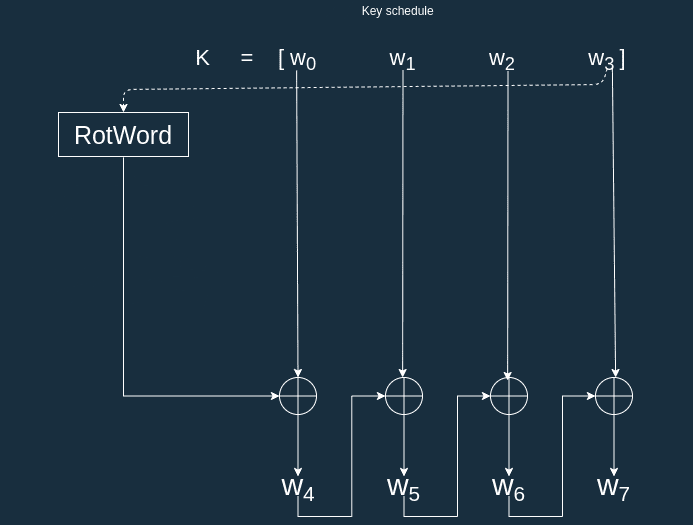

# Feistel Encryptor
The following code is an implementation of a simple Feistel structure cipher. At The current state it takes 2 64-bit 
unsigned integers and returns an encrypted version of them.

## Algorithm Specification
The key size for this algorithm is 64 bits. Each block is 128 bits.The encryption is carried out in 4 rounds. For 
generating the 4 subkeys, a simple rotation algorithm similar to the one in AES is employed. The round function for this
cipher is a simple xor.

## key class
The key class is where all the functions related to key management are carried out.
A key can be generated randomly or with a user defined number.
```c++
//Random key generation code
std::random_device rd;
std::mt19937_64 gen(rd());
std::uniform_int_distribution<uint64_t> dis;
k = dis(gen);
setWord();
```
Some utility functions are also implemented in this class. These functions are for retrieving individual words of the 
key, rotating the words of the key and generating a subkey from the key.


In the rot word function a 16-bit word with [a0, a1, a2, a3] is transformed to [a1, a2, a3, a0].

## Feistel class
In this class some general configurations for our Feistel encryptor are handled. The function `calcFeistelRound`,
calculates a round of the Feistel procedure.
```c++
uint64_t feistel::calcFeistelRound(key r_k, uint64_t l, uint64_t r)
{
    uint64_t r_k_u = r_k.getKey();
    uint64_t tmp = r ^ r_k_u;
    return tmp ^ l;
}
```
The main part of this class is the encrypt and decrypt functions.
```c++
std::vector<uint64_t> feistel::encrypt(uint64_t lpt,uint64_t rpt)
{
    uint64_t r1 = calcFeistelRound(subKeys[0],lpt,rpt);
    uint64_t r2 = calcFeistelRound(subKeys[1],rpt,r1);
    uint64_t r3 = calcFeistelRound(subKeys[2],r1,r2);
    uint64_t r4 = calcFeistelRound(subKeys[3],r2,r3);
    return {r4,r3};
}

std::vector<uint64_t> feistel::decrypt(uint64_t lct, uint64_t rct)
{
    uint64_t r1 = calcFeistelRound(subKeys[3],lct,rct);
    uint64_t r2 = calcFeistelRound(subKeys[2],rct,r1);
    uint64_t r3 = calcFeistelRound(subKeys[1],r1,r2);
    uint64_t r4 = calcFeistelRound(subKeys[0],r2,r3);
    return {r4,r3};
}
```
In general a simple 4 round Feistel is implemented in the 2 functions.
